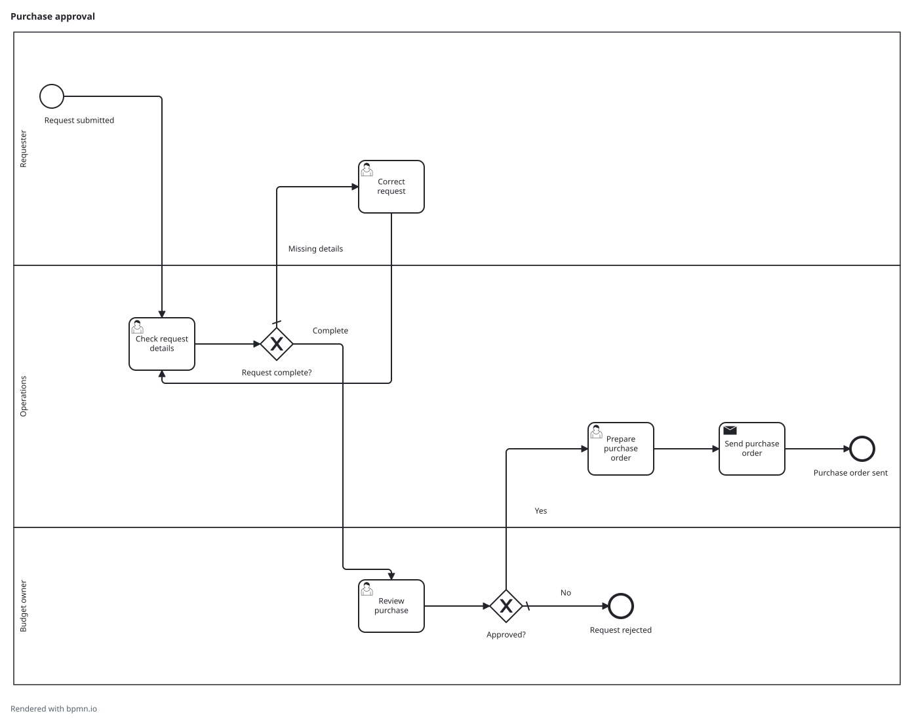

# BPMN Weave

Turn process descriptions and conversations into reviewable BPMN 2.0 models.

BPMN Weave is designed to work inside an existing agent session: describe how work happens, clarify the important gaps, and refine the result through discussion. One portable Modeling Skill works with a small deterministic local CLI. The output is a standards-based BPMN file, a readable SVG preview, and a separate Quality Report.

## Status

Development build: `0.1.0-dev.0`. The CLI and portable skill are being implemented and tested; **v0.1.0 is not released or qualified yet**. Full-profile readability, offline/platform qualification, and real host/human acceptance remain release gates. A successful example is not evidence that those gates passed.

- [Build progress](https://github.com/ve250104/OpenBPMN/issues/19)
- [Scope and verification status](docs/support.md)

## Try the development build

Prerequisites: Node.js **24.x**, npm, and an installed Google Chrome or Microsoft Edge. Validation and capability inspection do not require a browser. The CLI does not download one.

```sh
git clone --branch wip/v0-implementation https://github.com/ve250104/OpenBPMN.git
cd OpenBPMN
npm ci --ignore-scripts
npm run build
node dist/cli.js capabilities
node dist/cli.js generate --input examples/invoice-review.json --output my-process
```

The output is `my-process.bpmn`, `my-process.svg`, and `my-process.quality.json`. Open the SVG to review the diagram; use the BPMN file in a modeling tool. The example is authored synthetic fiction under the project’s MIT license.

For conversational use, install the matching [portable skill](skills/bpmn-weave/SKILL.md), then describe your process in your existing agent session:

> Document our purchase approval process. Operations checks submitted requests, asks the requester to correct missing details, and sends complete requests to the budget owner. Rejected requests end; approved requests become purchase orders. Show me the diagram so we can refine it.

The skill uses the CLI, keeps source evidence and unresolved questions separate, and asks about consequential gaps. It does not require a process workspace or a fixed interview questionnaire.



[Example BPMN](examples/purchase-approval.bpmn) · [Authored request](examples/purchase-approval.json) · [Quality Report](examples/purchase-approval.quality.json)

[Installation](docs/installation.md) · [Modeling guide](docs/modeling.md) · [Command reference](docs/commands.md) · [Troubleshooting](docs/troubleshooting.md)

## Product boundary

The Host Agent handles the conversation and process evidence. The local Core owns model compilation, validation, layout, and export. No hosted service, account, database, project workspace, or graphical editor is provided.

Process questions and quality findings stay outside the BPMN file. Users can request an incomplete, structurally valid snapshot for discussion; the tool does not assign approval or lifecycle status. The CLI also validates and renders existing BPMN without implying semantic import or repair.

The required agent surfaces are Codex CLI, Claude Code, and GitHub Copilot CLI. SAP Signavio and distinct Celonis workflows have explicit qualification profiles; no verified vendor-import claim is made before the corresponding test.

## Project

The repository keeps its original OpenBPMN URL; the public product name is BPMN Weave. [Contributing](https://github.com/ve250104/OpenBPMN/blob/wip/v0-implementation/CONTRIBUTING.md) covers development; the [architecture](https://github.com/ve250104/OpenBPMN/blob/wip/v0-implementation/docs/architecture.md) and [build plan](https://github.com/ve250104/OpenBPMN/blob/wip/v0-implementation/docs/build-plan.md) explain the implementation contracts.

Inspired by [bpmn-js](https://github.com/bpmn-io/bpmn-js) and the agent-first workflow of [diagram-design](https://github.com/cathrynlavery/diagram-design). Project-authored material uses the [MIT license](LICENSE); [third-party notices](THIRD_PARTY_NOTICES.md) retain dependency terms and identify unresolved redistribution gates.
