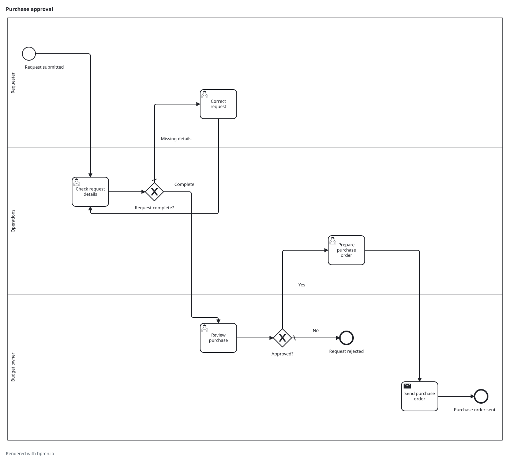

# Modeling through conversation

Describe the process you want to document and the result you need. You can supply a local interview, notes, or a previously requested `.openbpmn.json` Handoff. The host handles interpretation; the local CLI turns the current structured request into artifacts.

You should receive a useful early diagram when the available facts support one. When a missing fact would change responsibility, routing, or an outcome, the agent asks a focused question. Otherwise, correct the preview naturally: “Finance owns this check,” “Add the rejection route,” or “Rename that step.” Unchanged elements retain their identities.

The standard bundle contains:

- `.bpmn`: process meaning plus diagram geometry, without tool-specific findings or lifecycle tags.
- `.svg`: a read-only preview with embedded fonts and panels for relevant subprocess/called-process detail.
- `.quality.json`: technical checks, advisories, evidence references, and unresolved questions.

“Export a snapshot now” shares the currently expressible, structurally valid model with limitations in its separate report. Clean eligibility is technical, not approval or a promise that an interview is correct. The human alone decides labels such as draft, approved, or final.

“Update this process” authorizes replacing its named bundle; a general modeling request does not. Failed updates preserve prior output under the documented handled-failure guarantee. A previous preview is identified as unchanged, never presented as the new result.

Ask explicitly for a Handoff to continue in a fresh session or another host. It contains the structured request and concise review context, not your transcript or original documents. Ordinary conversation has no automatic persistent sidecar. Read [the skill](../skills/bpmn-weave/SKILL.md) for the maintained agent workflow and the [protocol](https://github.com/ve250104/OpenBPMN/blob/main/docs/contracts.md) for machine details.

Supplied `.bpmn` files can be validated and rendered with their existing geometry. V0 does not import arbitrary BPMN for conversational editing, repair a vendor file, or promise engine execution.

## An authored example

This walkthrough is synthetic MIT-licensed fiction. The description, clarification, answer, and correction below are authored teaching material, **not a transcript of a real host session or human usability test**. Both diagrams and their companion reports were generated by the installed development CLI; no exported XML or SVG was hand-repaired. This demonstrates deterministic artifact generation from confirmed structured requests, not the reliability of an agent's interpretation.

**Starting description:** “We raise small purchase requests. Operations checks the details, and the budget owner approves or rejects them. Rejections end the process. Operations prepares and sends the approved order. Sometimes details are missing.”

**Consequential clarification:** “Who supplies missing details, and does the corrected request return to Operations before approval?”

**Authored answer:** “The requester corrects it, then Operations checks it again. Only complete requests reach the budget owner. This example covers low-value requests needing a single budget approval.”

Those confirmed facts are recorded in the [initial request](../examples/purchase-approval.json), including its explicit scope decision. The correction loop and three responsibilities appear in the generated preview:


[Initial BPMN](../examples/purchase-approval.bpmn) · [Initial Quality Report](../examples/purchase-approval.quality.json)

**Authored correction:** “The budget owner sends the purchase order; Operations only prepares it. Keep the rest of the process unchanged.”

The [corrected request](../examples/purchase-approval-corrected.json) retains the initial account, adds the correction and the explicit ownership decision, and records the disagreement as resolved. The sending activity and completion move to the Budget owner lane; all existing activity, event, flow, and lane keys remain unchanged.



[Corrected BPMN](../examples/purchase-approval-corrected.bpmn) · [Corrected Quality Report](../examples/purchase-approval-corrected.quality.json)

Both examples returned `clean_export_ready` with all nine reported checks passed and no findings. Their reports still retain the authored evidence and, after correction, the resolved conflict. That result establishes the reported technical checks, not business truth, human approval, measured savings, or downstream vendor compatibility. Agent inspection of the generated preview is not human release acceptance.

To reproduce from an installed CLI, create an empty output directory, then run against the two request files from the examples supplied with the candidate:

```sh
bpmn-weave generate --input examples/purchase-approval.json --output demo/purchase-initial --human
bpmn-weave generate --input examples/purchase-approval-corrected.json --output demo/purchase-corrected --human
```

The checked-in outputs were regenerated using the installed `0.1.0-dev.0` development archive and Node 24.19.0 on macOS arm64. This is a reproducible authored illustration; real Codex, Claude Code, Copilot, cross-host, and maintainer workflow observations remain separate release gates.
